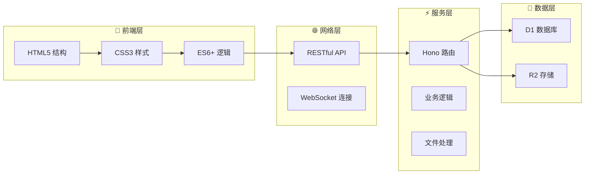
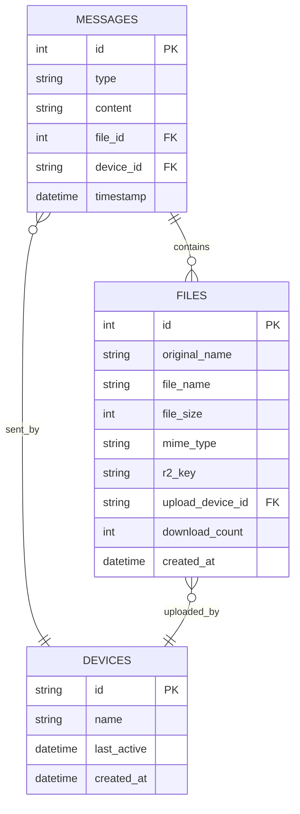

# 微信文件传输助手 Web 应用

基于 Cloudflare Workers 的微信文件传输助手 Web 应用，采用**单文件全栈架构**，实现跨设备文件传输和消息同步功能。

## 🚀 功能特性

- 📱 **跨设备同步**: 支持多设备间的消息和文件同步
- 📄 **文件传输**: 支持各种格式文件的上传和下载（最大10MB）
- 💬 **文本消息**: 发送和接收文本消息
- 📝 **Markdown渲染**: 自动识别并渲染Markdown语法，支持源码/渲染视图切换
- 🖼️ **图片预览**: 自动显示图片文件预览
- 📊 **消息历史**: 完整的消息历史记录
- 🔄 **实时更新**: 自动刷新获取最新消息（5秒间隔）

## 🛠️ 技术栈

- **前端**: 原生HTML + CSS + JavaScript（模块化设计）
- **后端**: Hono (Cloudflare Workers)
- **数据库**: Cloudflare D1
- **文件存储**: Cloudflare R2
- **部署**: Cloudflare Workers + 静态资源

## 📦 项目结构

<details>
<summary>🗂️ 点击展开完整项目结构</summary>

```
📁 wxchat/
├── 📄 README.md              # 📖 项目说明文档
├── 📄 package.json           # 📦 项目配置和依赖
├── 📄 wrangler.toml          # ⚙️ Cloudflare Workers 配置
├── 📄 build.js               # 🔨 构建脚本
│
├── 📁 public/                # 🎨 前端静态资源
│   ├── 📄 index.html         # 🏠 主页面入口
│   │
│   ├── 📁 css/               # 🎨 样式文件
│   │   ├── 📄 reset.css      # 🔄 CSS重置样式
│   │   ├── 📄 main.css       # 🎯 主要样式定义
│   │   ├── 📄 components.css # 🧩 组件样式库
│   │   └── 📄 responsive.css # 📱 响应式设计
│   │
│   └── 📁 js/                # ⚡ JavaScript模块
│       ├── 📄 config.js      # ⚙️ 应用配置中心
│       ├── 📄 utils.js       # 🛠️ 工具函数库
│       ├── 📄 api.js         # 🌐 API接口封装
│       ├── 📄 ui.js          # 🎨 UI操作管理
│       ├── 📄 fileUpload.js  # 📁 文件上传处理
│       ├── 📄 messageHandler.js # 💬 消息处理逻辑
│       └── 📄 app.js         # 🚀 应用程序入口
│
├── 📁 worker/                # ⚡ 后端服务代码
│   └── 📄 index.js           # 🔧 API服务和路由
│
└── 📁 database/              # 🗄️ 数据库相关
    └── 📄 schema.sql         # 🏗️ 数据库结构定义
```

</details>

### 🏗️ 架构设计



## 🚀 快速开始

### 📋 前置要求

- ✅ **Cloudflare 账户** - [免费注册](https://dash.cloudflare.com/sign-up)
- ✅ **Node.js 18+** - [下载安装](https://nodejs.org/)
- ✅ **Git** - [下载安装](https://git-scm.com/)

### ⚡ 一键部署

```bash
# 1️⃣ 克隆项目
git clone https://github.com/xiyewuqiu/wxchat.git
cd wxchat

# 2️⃣ 安装依赖
npm install

# 3️⃣ 登录 Cloudflare
npx wrangler login

# 4️⃣ 创建 D1 数据库
npx wrangler d1 create wxchat

# 5️⃣ 创建 R2 存储桶
npx wrangler r2 bucket create wxchat

# 6️⃣ 初始化数据库（二选一）
# 方法1：命令行初始化
npx wrangler d1 execute wxchat --file=./database/schema.sql

# 方法2：控制台初始化（推荐）
# 见下方"数据库初始化"部分

# 7️⃣ 部署应用
npm run deploy
```

### 🗄️ 数据库初始化

如果遇到 HTTP 500 错误，通常是数据库未正确初始化导致的。请使用以下方法之一初始化数据库：

<details>
<summary><strong>📋 方法1：Cloudflare D1 控制台初始化（推荐）</strong></summary>

1. 打开 [Cloudflare Dashboard](https://dash.cloudflare.com/)
2. 进入 **Workers & Pages** → **D1 SQL Database**
3. 选择你的 `wxchat` 数据库
4. 点击 **控制台** 标签页
5. 将以下完整SQL代码复制粘贴到查询框中并执行：

```sql
-- 微信文件传输助手数据库完整初始化脚本
-- 直接在Cloudflare D1控制台执行

-- 删除已存在的表（如果需要重新初始化）
DROP TABLE IF EXISTS messages;
DROP TABLE IF EXISTS files;
DROP TABLE IF EXISTS devices;

-- 创建消息表
CREATE TABLE messages (
    id INTEGER PRIMARY KEY AUTOINCREMENT,
    type TEXT NOT NULL CHECK (type IN ('text', 'file')),
    content TEXT,
    file_id INTEGER,
    device_id TEXT NOT NULL,
    timestamp DATETIME DEFAULT CURRENT_TIMESTAMP,
    created_at DATETIME DEFAULT CURRENT_TIMESTAMP,
    updated_at DATETIME DEFAULT CURRENT_TIMESTAMP,
    FOREIGN KEY (file_id) REFERENCES files(id)
);

-- 创建文件表
CREATE TABLE files (
    id INTEGER PRIMARY KEY AUTOINCREMENT,
    original_name TEXT NOT NULL,
    file_name TEXT NOT NULL,
    file_size INTEGER NOT NULL,
    mime_type TEXT NOT NULL,
    r2_key TEXT NOT NULL UNIQUE,
    upload_device_id TEXT NOT NULL,
    download_count INTEGER DEFAULT 0,
    created_at DATETIME DEFAULT CURRENT_TIMESTAMP,
    updated_at DATETIME DEFAULT CURRENT_TIMESTAMP
);

-- 创建设备表
CREATE TABLE devices (
    id TEXT PRIMARY KEY,
    name TEXT,
    last_active DATETIME DEFAULT CURRENT_TIMESTAMP,
    created_at DATETIME DEFAULT CURRENT_TIMESTAMP,
    updated_at DATETIME DEFAULT CURRENT_TIMESTAMP
);

-- 创建索引以提高查询性能
CREATE INDEX idx_messages_timestamp ON messages(timestamp DESC);
CREATE INDEX idx_messages_device_id ON messages(device_id);
CREATE INDEX idx_messages_type ON messages(type);
CREATE INDEX idx_files_r2_key ON files(r2_key);
CREATE INDEX idx_files_upload_device ON files(upload_device_id);
CREATE INDEX idx_devices_last_active ON devices(last_active DESC);

-- 插入默认设备
INSERT INTO devices (id, name) VALUES
('web-default', 'Web浏览器'),
('mobile-default', '移动设备');

-- 验证表创建成功
SELECT 'Tables created successfully!' as status;
SELECT name FROM sqlite_master WHERE type='table';
```

执行成功后，你应该看到：
- ✅ `Tables created successfully!` 成功消息
- ✅ 显示所有创建的表名列表：`devices`, `files`, `messages`

</details>

<details>
<summary><strong>💻 方法2：命令行初始化</strong></summary>

在项目根目录执行：

```bash
npx wrangler d1 execute wxchat --file=./database/schema.sql
```

</details>

<details>
<summary><strong>🔍 验证数据库状态</strong></summary>

初始化完成后，可以通过以下方式验证：

1. **控制台验证**：在D1控制台执行
```sql
SELECT name FROM sqlite_master WHERE type='table';
```

2. **健康检查API**：访问你的应用URL + `/api/health`
```
https://your-app.workers.dev/api/health
```

3. **检查表结构**：
```sql
.schema messages
.schema files
.schema devices
```

</details>

### 🎯 配置说明

在 `wrangler.toml` 中配置你的资源：

```toml
name = "wxchat"
main = "worker/index.js"
compatibility_date = "2025-06-17"

# D1 数据库配置
[[d1_databases]]
binding = "DB"
database_name = "wxchat"
database_id = "b58dde57-d777-459f-a6b3-ae4de9c16368"  # 实际数据库ID

# R2 存储桶配置
[[r2_buckets]]
binding = "R2"
bucket_name = "wxchat"
```

## 📱 使用指南

### 🎮 基础功能

<div align="center">

| 功能 | 操作方式 | 说明 |
|------|---------|------|
| 💬 **发送消息** | 输入框输入 → 点击发送 | 支持文本和表情符号 |
| 📝 **Markdown渲染** | 输入Markdown语法 → 自动渲染 | 支持标题、粗体、列表、代码等 |
| 🔄 **视图切换** | 点击消息右下角📝按钮 | 在渲染视图和源码视图间切换 |
| 📁 **上传文件** | 点击📁按钮 或 拖拽文件 | 最大10MB，支持所有格式 |
| ⬇️ **下载文件** | 点击文件消息中的下载按钮 | 保持原始文件名 |
| 🔄 **跨设备同步** | 不同设备访问相同URL | 自动同步所有消息和文件 |

</div>

### 🎯 高级功能

#### 📝 Markdown渲染功能

支持自动识别和渲染Markdown语法，让消息更加丰富和美观：

**支持的语法**：
```markdown
# 一级标题
## 二级标题
### 三级标题

**粗体文字** 和 *斜体文字*

- 无序列表项1
- 无序列表项2

1. 有序列表项1
2. 有序列表项2

> 引用文字

`行内代码`

```代码块
console.log('Hello World');
```

[链接文字](https://example.com)

---
分割线
```

**使用方式**：
1. 📝 **自动检测** - 输入包含Markdown语法的消息时自动渲染
2. 🔄 **视图切换** - 点击消息右下角的📝按钮切换源码/渲染视图
3. 🎨 **样式优化** - 渲染后的内容保持微信风格的美观设计

#### 🧹 数据清理功能

当存储空间不足时，可以使用数据清理功能：

```
1️⃣ 发送清理指令：
   /clear-all
   清空数据
   /清空
   clear all

2️⃣ 确认操作：
   点击确认对话框的"确定"

3️⃣ 输入确认码：
   输入：1234

4️⃣ 查看清理结果：
   ✅ 数据清理完成！
   📊 清理统计：
   • 删除消息：XX 条
   • 删除文件：XX 个
   • 释放空间：XX MB
```

#### 📱 微信移动端体验

- **动态发送按钮** - 输入时出现圆形绿色按钮
- **平滑动画** - 微信级别的过渡效果
- **触摸优化** - 移动端友好的交互设计
- **响应式布局** - 完美适配各种屏幕尺寸

### 🔧 快捷操作

| 快捷键 | 功能 | 说明 |
|--------|------|------|
| `Enter` | 发送消息 | 在输入框中按回车发送 |
| `Shift + Enter` | 换行 | 在消息中添加换行符 |
| `Ctrl + V` | 粘贴文件 | 从剪贴板粘贴图片文件 |
| 拖拽 | 上传文件 | 拖拽文件到聊天区域上传 |

## 🔧 API 接口文档

### 📡 RESTful API

<details>
<summary>📋 点击查看完整API文档</summary>

#### 💬 消息相关

```http
GET /api/messages
```
**功能**: 获取消息列表
**参数**:
- `limit` (可选): 限制返回数量，默认50
- `offset` (可选): 偏移量，默认0

**响应**:
```json
{
  "success": true,
  "data": [
    {
      "id": 1,
      "type": "text",
      "content": "Hello World",
      "device_id": "web-123456",
      "timestamp": "2025-06-17T00:00:00Z"
    }
  ]
}
```

---

```http
POST /api/messages
```
**功能**: 发送文本消息
**请求体**:
```json
{
  "content": "消息内容",
  "deviceId": "设备ID"
}
```

#### 📁 文件相关

```http
POST /api/files/upload
```
**功能**: 上传文件
**请求**: `multipart/form-data`
- `file`: 文件数据
- `deviceId`: 设备ID

```http
GET /api/files/download/:r2Key
```
**功能**: 下载文件
**参数**: `r2Key` - R2存储键

#### 🔄 设备同步

```http
POST /api/sync
```
**功能**: 设备同步
**请求体**:
```json
{
  "deviceId": "设备ID",
  "deviceName": "设备名称"
}
```

#### 🧹 数据清理

```http
POST /api/clear-all
```
**功能**: 清空所有数据
**请求体**:
```json
{
  "confirmCode": "1234"
}
```

</details>

### 🗄️ 数据库设计

<details>
<summary>📊 点击查看数据库结构</summary>

#### 📋 表结构

```sql
-- 消息表
CREATE TABLE messages (
    id INTEGER PRIMARY KEY AUTOINCREMENT,
    type TEXT NOT NULL CHECK (type IN ('text', 'file')),
    content TEXT,
    file_id INTEGER,
    device_id TEXT NOT NULL,
    timestamp DATETIME DEFAULT CURRENT_TIMESTAMP,
    FOREIGN KEY (file_id) REFERENCES files(id)
);

-- 文件表
CREATE TABLE files (
    id INTEGER PRIMARY KEY AUTOINCREMENT,
    original_name TEXT NOT NULL,
    file_name TEXT NOT NULL,
    file_size INTEGER NOT NULL,
    mime_type TEXT NOT NULL,
    r2_key TEXT NOT NULL UNIQUE,
    upload_device_id TEXT NOT NULL,
    download_count INTEGER DEFAULT 0,
    created_at DATETIME DEFAULT CURRENT_TIMESTAMP
);

-- 设备表
CREATE TABLE devices (
    id TEXT PRIMARY KEY,
    name TEXT,
    last_active DATETIME DEFAULT CURRENT_TIMESTAMP,
    created_at DATETIME DEFAULT CURRENT_TIMESTAMP
);
```

#### 🔗 关系图



</details>

## 🚀 部署指南

### 🌍 生产环境部署

<details>
<summary>🔧 详细部署步骤</summary>

#### 1️⃣ GitHub Actions 自动部署

创建 `.github/workflows/deploy.yml`:

```yaml
name: Deploy to Cloudflare Workers

on:
  push:
    branches: [ main ]

jobs:
  deploy:
    runs-on: ubuntu-latest
    steps:
      - uses: actions/checkout@v3

      - name: Setup Node.js
        uses: actions/setup-node@v3
        with:
          node-version: '18'

      - name: Install dependencies
        run: npm install

      - name: Deploy to Cloudflare Workers
        uses: cloudflare/wrangler-action@v3
        with:
          apiToken: ${{ secrets.CLOUDFLARE_API_TOKEN }}
```

#### 2️⃣ 环境变量配置

在 GitHub Secrets 中添加：
- `CLOUDFLARE_API_TOKEN`: Cloudflare API 令牌

#### 3️⃣ 域名配置

```bash
# 绑定自定义域名
npx wrangler route add "your-domain.com/*" wxchat
```

</details>

### 📊 性能监控

<details>
<summary>📈 监控和分析</summary>

#### Cloudflare Analytics

- **请求量监控**: 实时查看API调用量
- **错误率追踪**: 监控应用健康状态
- **性能分析**: 响应时间和延迟统计

#### 存储使用情况

```bash
# 查看 D1 数据库使用情况
npx wrangler d1 info wxchat

# 查看 R2 存储使用情况
npx wrangler r2 bucket info wxchat
```

</details>

## 💡 设计理念

<div align="center">

### 🎯 核心原则

| 原则 | 说明 | 实现 |
|------|------|------|
| **🚀 性能优先** | 极致的加载速度和响应性能 | 边缘计算 + CDN加速 |
| **📱 移动优先** | 完美的移动端用户体验 | 响应式设计 + 触摸优化 |
| **🛡️ 安全可靠** | 数据安全和隐私保护 | 多重验证 + 安全传输 |
| **🎨 美观易用** | 直观的界面和流畅的交互 | 微信级UI + 平滑动画 |
| **⚡ 零配置** | 开箱即用的部署体验 | 一键部署 + 自动配置 |

</div>

### 🌟 技术亮点

- **🔥 零依赖前端** - 纯原生技术栈，极致性能
- **⚡ 边缘计算** - 全球部署，毫秒级响应
- **📱 微信级UI** - 像素级还原微信界面
- **🛡️ 企业级安全** - 多重验证，数据保护
- **🚀 自动扩容** - 无服务器架构，按需付费

## 🤝 贡献指南

### 🔧 开发环境

```bash
# 克隆项目
git clone https://github.com/xiyewuqiu/wxchat.git
cd wxchat

# 安装依赖
npm install

# 本地开发
npm run dev

# 代码检查
npm run lint

# 构建项目
npm run build
```

### 📝 提交规范

```
feat: 新功能
fix: 修复bug
docs: 文档更新
style: 代码格式
refactor: 重构
test: 测试相关
chore: 构建过程或辅助工具的变动
```

### 🔧 故障排除

<details>
<summary><strong>❌ HTTP 500 错误 - 数据库未初始化</strong></summary>

**症状**: 访问应用时出现 `HTTP 500: Internal Server Error`

**原因**: 数据库表未创建或初始化失败

**解决方案**:
1. 检查数据库状态：访问 `https://your-app.workers.dev/api/health`
2. 如果显示表不存在，请按照上方"数据库初始化"部分重新初始化
3. 确认 `wrangler.toml` 中的数据库ID正确

</details>

<details>
<summary><strong>🔗 数据库连接失败</strong></summary>

**症状**: API返回 `数据库配置错误：DB绑定未找到`

**原因**: D1数据库绑定配置错误

**解决方案**:
1. 检查 `wrangler.toml` 中的数据库配置：
```toml
[[d1_databases]]
binding = "DB"
database_name = "wxchat"
database_id = "your-database-id"
```
2. 确认数据库ID与实际创建的数据库匹配
3. 重新部署应用：`npm run deploy`

</details>

<details>
<summary><strong>📁 文件上传失败</strong></summary>

**症状**: 文件上传时出现错误

**原因**: R2存储桶配置问题或权限不足

**解决方案**:
1. 检查 `wrangler.toml` 中的R2配置：
```toml
[[r2_buckets]]
binding = "R2"
bucket_name = "wxchat"
```
2. 确认R2存储桶已创建：`npx wrangler r2 bucket list`
3. 检查文件大小是否超过限制（默认10MB）

</details>

<details>
<summary><strong>🌐 CORS 跨域问题</strong></summary>

**症状**: 浏览器控制台显示CORS错误

**原因**: 跨域请求被阻止

**解决方案**:
1. 确认应用已正确部署到Cloudflare Workers
2. 检查是否使用了正确的域名访问
3. 清除浏览器缓存并重试

</details>

<details>
<summary><strong>📱 移动端显示异常</strong></summary>

**症状**: 移动设备上界面显示不正常

**原因**: 缓存或兼容性问题

**解决方案**:
1. 清除浏览器缓存
2. 尝试使用无痕模式访问
3. 确认使用现代浏览器（Chrome、Safari、Firefox等）

</details>

### 🐛 问题反馈

遇到问题？请通过以下方式反馈：

- 🐛 [提交 Issue](https://github.com/xiyewuqiu/wxchat/issues)
- 💬 [讨论区](https://github.com/xiyewuqiu/wxchat/discussions)
- 📧 邮件联系: xiyewuqiu@gmail.com

**反馈时请提供**:
- 🌐 访问的URL
- 📱 使用的设备和浏览器
- 🔍 具体的错误信息
- 📋 重现步骤

## 📄 许可证

<div align="center">

**CC BY-NC-SA 4.0 License**

[](https://creativecommons.org/licenses/by-nc-sa/4.0/)

Copyright (c) 2025 微信文件传输助手

本项目采用 [Creative Commons Attribution-NonCommercial-ShareAlike 4.0 International License](https://creativecommons.org/licenses/by-nc-sa/4.0/) 许可证。

### 🚫 **严格禁止商业用途**

- ✅ **允许**: 个人学习、研究、非营利使用
- ✅ **允许**: 修改和分发（需保持相同许可证）
- ✅ **允许**: 署名使用
- ❌ **禁止**: 任何形式的商业用途
- ❌ **禁止**: 商业销售或盈利

### 📋 使用条件

1. **署名** - 必须给出适当的署名，提供指向许可证的链接
2. **非商业性使用** - 不得将本作品用于商业目的
3. **相同方式共享** - 如果您再混合、转换或者基于本作品进行创作，您必须基于与原先许可协议相同的许可协议分发您贡献的作品

---

<p>
  <strong>🌟 如果这个项目对你有帮助，请给个 Star ⭐</strong><br>
  <em>Made with ❤️ by xiyewuqiu</em>
</p>

<p>
  <a href="#-微信文件传输助手-web-应用">回到顶部 ⬆️</a>
</p>

</div>
